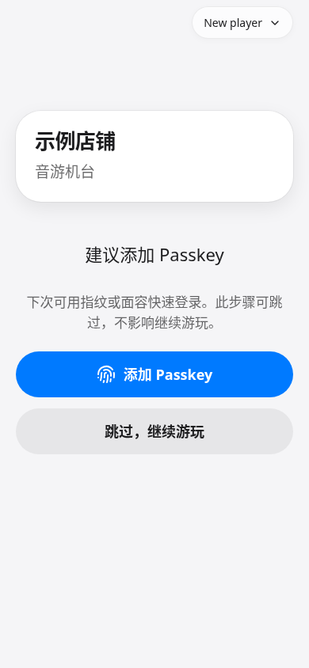

# PRiSM Next 系统架构设计

## 设计方向

PRiSM Next 是一款单店、可自托管的场馆运营核心系统。系统支持将 Cloudflare 部署与本地化部署作为一等公民，但领域模型必须保持纯粹，不依赖于任何特定的运行环境。

## 模块与包边界

- `packages/core`：纯粹的 TypeScript 领域逻辑。禁止在此引入 Hono、数据库客户端、Cloudflare 绑定、Koishi API、文件系统访问或网络请求。
  - `assets`：资产定义、计费效果、资产持有量、合并赠送策略、资产账本流水。
  - `session`：活跃/已关闭场次的生命周期。
  - `settlement`：费用项收集、资产效果调整、货币扣减和结算输出。
  - `pricing-config`：持久化计费配置模型、基本校验以及配置到计费提供商的构建器。
  - `pricing-time`：默认时间计费和优先级时间计费规则。
  - `redeem`：礼物兑换规则与礼物赠送。
  - `device-command`：设备动作授权、设施/游戏机器目标分类、执行器选择、投币冷却、响应确认（ACK）和过期状态流转。
  - `storage-ports`：场次、资产、兑换记录、结算、设备命令、玩家和计费配置的仓储契约（Repository Ports）。
- `packages/storage-sql`：兼容 SQLite/D1 的 DDL、写仓储和 SQL 读模型。需要聚合多张表的列表由这里用单条关联查询完成，再调用 core 的统一领域判断；运行时适配器仅提供 SQL 执行器。
- `packages/adapter-sqlite`：本地部署下的 Bun SQLite 执行器包装。
- `packages/adapter-d1`：Cloudflare Worker 部署下的 D1 执行器包装。
- `packages/server`：统一合并的 PRiSM 服务端包，收拢原 `platform`、`runtime` 与 `server-hono` 的服务端能力。
  - `src/bindings.ts`：Hono 上下文核心类型定义（`AppBindings`、`Env`、`Variables`、`TenantShop`、`AuthUser`、`PrismAppDependencies`）。
  - `src/middleware`：核心中间件集合。
    - `auth.ts`：统一身份认证与会话中间件（Bearer token / Cookie 会话提取、`attachUser`、`requireUser`、`optionalUser`、`requireAdmin`、`staffPrincipal` 权限解析与店铺员工账户自举）。
    - `tenant.ts`：多租户店铺解析与依赖注入中间件（根据 `:shopCode` 从数据库解析店铺，自动组装并内存缓存店铺级应用依赖 `PrismAppDependencies`，注入 `c.set("shop", shop)` 和 `c.set("deps", deps)`，并注入时区 `responseTimeZone`）。
    - `cors.ts`：安全 CORS 中间件（严格校验 `APP_ORIGIN` 与 `EXTRA_ALLOWED_ORIGINS`，禁止在携带凭据时反射未受信任的任意 Origin，拦截未授权来源的状态变更请求）。
    - `rate-limit.ts`：限流中间件（优先调用 Cloudflare Worker 原生 `RATE_LIMIT_*` 绑定，本地或单机环境平滑降级至内存滑动窗口限流）。
    - `geo.ts`：地理围栏校验与店铺距离计算（基于 Haversine 公式与精度限制进行进出店及设备操作的围栏校验）。
    - `response-time.ts`：API 响应时间投影与格式包装中间件（拦截 `/api/v1/*` 响应，自动将 UTC 瞬时时间戳按店铺当地时区转换为带偏移量的时间字符串并包装统一 JSON 响应）。
  - `src/routes`：服务端 REST API 路由分层。
    - `platform/`：平台级路由（`auth.ts`, `passkeys.ts`, `user.ts`, `shops.ts`），处理平台登录、Passkey 凭据与店铺生命周期。
    - `system/`：系统探针路由（`health.ts`, `version.ts`）。
    - `web-assets.ts`：静态前端 SPA 资源代理与维护期拦截。
    - `shops/`：多租户店铺级业务路由（`player.ts`, `staff.ts`, `integration.ts`, `devices.ts`, `pricing.ts`, `assets.ts`, `cashier.ts`, `redeem.ts`）。依托 `tenantMiddleware` 依赖注入直接调用应用层服务，彻底废除了旧版的虚拟 HTTP 请求转发（`createPrismApp().fetch()`）。
  - `src/legacy`：遗留单店 API 集中隔离与弃用管理模块。收拢旧版未携带 `:shopCode` 的单店 API（`/api/v1/player/*`, `/api/v1/staff/*`, `/api/v1/integration/*`, `/api/v1/setup/*`），自动附加 `X-API-Deprecated: true`、`X-API-Replacement`、`Link` 与 `Warning` 弃用标头，并提供回退租户解析与详细迁移指南，详见 [packages/server/src/legacy/README.md](../packages/server/src/legacy/README.md)。
  - `src/hardware`：统一整合的硬件驱动与执行器模块。包含 Hinata E2EE 卡片/投币驱动与执行器（`hinata.ts`，统一 PBKDF2/AES-GCM 与重试回退语义）、TTLock 云开锁与临时密码执行器（`ttlock.ts`）、Home Assistant 设施实体动作与状态执行器（`home-assistant.ts`）以及街机机台 WebSocket 协议处理器（`machine-ws.ts`）。
  - `src/app.ts` 与 `src/worker.ts`：顶层 Hono 应用装配工厂（`createApp()` / `app`）与 Cloudflare Worker 入口点。整合 CORS、响应耗时、静态资源兜底代理（`serveWebAssets`）、领域错误分发转换、多租户及遗留路由挂载；Worker 入口导出 `fetch`、`scheduled` 定时任务处理器与 `LiveBilling` Durable Object。
  - `src/durable-objects`：Apple Live Activity 实时活动与实时计费状态机。包含 `LiveBilling` Cloudflare Durable Object（支持闹钟定时唤醒与自适应指数退避重试）、实时账单增量计算（`live-activity-billing.ts`）以及 Apple APNs 推送协议与令牌校验实现（`live-activity-push.ts`）。
  - `src/deployment-gate.ts`：零停机部署栅栏门控。拦截 `/__prism_deploy` 部署动作与检查请求，执行维护窗口隔离、SQL schema 锁检查与 D1 状态围栏。
  - `src/tasks/cron-handlers.ts`：后台定时任务处理模块。实现 `purgeExpiredPlatformState`，按批次（每次最多 500 条）安全清理过期的临时验证凭据与已注销的平台状态。
  - `src/migrations/shop-time-zone-migration.ts`：店铺位置 IANA 时区幂等迁移脚本，基于经纬度地理编码解析缺失的时区配置并批量入库。
  - `src/local-server.ts` 与 `src/serve.ts`：本地 Bun 原生运行入口与独立服务端运行时。实现 `createD1DatabaseFromSqlite` 将 `bun:sqlite` 封装为 `D1DatabaseLike` 适配器；实现 `initializeLocalDatabase` 自动初始化 `@prism/storage-sql` 与平台表结构并配置默认管理用户与店铺计费；通过 `createLocalServer` 启动 `Bun.serve`，支持离线单店开发调试、HTTP 请求处理与机台 WebSocket 协议升级（`/rpc/machine/ws`）。
- `packages/application`：用例编排与跨适配器契约层。结合核心领域规则与仓储端口编排结算、员工现场操作、设备状态同步和统一资产效果；查询 DTO 与插件目录契约也定义在这里，避免内层依赖 Hono。`available-assets` 和 SQL 读模型都必须调用 core 的 `evaluateAssetHoldingAvailability`，不得重复实现可用性判断。
- 架构统一注记：原 `packages/server-hono`、`packages/runtime` 与 `packages/platform` 已在 2026-10-08 架构重构中彻底合并为单一的 `packages/server`；原虚拟 HTTP 请求转发（`createPrismApp().fetch()`）已完全消除，由 `tenantMiddleware` 直接提供原生依赖注入。
- `packages/prism-web`：唯一的 React 管理与玩家客户端。管理入口为 `/merchant/:shopCode`，负责现场运营、计费、资产、报表、设备、成员和设置；玩家入口负责设备扫码与店铺账单。
- React 时间显示使用店铺位置识别出的 IANA 时区，通过 `Intl`、`ui/bill-time.ts` 和计费时钟转换处理 UTC 时间戳及规则。报表查询把店铺日期范围转换为 UTC，不依赖浏览器自身时区。
- Staff Web 的权限门控与后端角色一致：viewer 保留查询、筛选、刷新、复制和审计详情能力，但现场结账、玩家修改、资产/计费配置和设备命令等写入口不可用；manager/owner 可以执行普通业务写入，员工账号与接入密钥管理仅 owner 可用，其他角色不会请求对应 owner-only 接口。退出登录会撤销持久化管理员会话，不只清理浏览器本地 Token。
- `packages/koishi-plugin`（git 子模块，独立仓库 `koishi-plugin-prism`）：直接调用 Integration HTTP API 的 Koishi 机器人插件。

## 接入身份模型

当前持久化 API Token 只分为两类：

- `integration`：机器人、Koishi/AstrBot 或店内自有入口服务使用。它代表受信任的店内入口，后续通过结构化外部身份（如 `provider=onebot, subject=123456`）发起玩家相关动作。
- `machine`：游戏机软件或可控制游戏机的小主机使用。它代表机器软件接入，只通过 `/rpc/machine/ws` 接收实时命令、确认执行结果并发送心跳。

员工后台不再创建 `player`、`bot` 或 `agent` API Token。玩家 Web 入口使用绑定到单个玩家的 player session；机器侧也使用 `machine` 语言，避免把 Home Assistant 设施控制和游戏机软件能力混在一个「Agent」概念里。

玩家 Web 入口使用 `POST /rpc/player-auth/login/by-identity` 创建 `player_sessions`。会话记录只保存 token hash、玩家 ID、过期时间、最后使用时间和撤销时间；浏览器随后调用 `/rpc/player/*` 时只发送玩家会话 Token。后端从 token hash 查出唯一玩家，不接受浏览器提供的 `X-PRiSM-Player-Id` 来切换身份。机器人、自助入口和店内外部服务如果需要按 平台身份或 Aime 身份操作玩家，仍应使用 `integration` API 和结构化外部身份，而不是借用玩家会话。

## 核心原则

**插件只能提议领域事实，不能直接修改状态。**

当前实现：

- 计费插件返回 `ChargeItem[]`。
- 核心结算系统汇总费用项。
- 核心结算系统扣减货币类的 `AssetHolding` 记录。
- 核心结算系统输出 `AssetLedgerEntry[]`。

通过这种设计，时间计费、套餐计费、人工费用、优惠券、月卡以及未来非时间类的商品，都能统一通过一套资产持有与资产账本系统进行集成结算。统一结账响应同时提供 `checkoutAdjustments` 和 `pricingCapAdjustments`：前者表示不属于单一 session 的整单优惠或人工调整，后者表示全局封顶的计价结果；兼容用的 `adjustments` 仍保留合集。展示层不得把两类调整附着到结账锚点 session，也不得把方案内封顶或全局封顶称为优惠。

**运输层关注点不得下沉到核心域。**

APNs 实时活动推送由 `@prism/server` 的 `durable-objects` 模块协调。玩家、员工、机器人操作经路由层处理后通知店铺／玩家对应的 `LiveBilling` Durable Object，麻将与设备操作也通知同一对象。核心域只提供与原计价一致的下一计费／规则边界计算，不依赖 APNs 或 Cloudflare。实时活动令牌与账单摘要接口由 `@prism/server` 处理，设计与失败处理见 `live-activity-push.md`。

## 资产模型

- `PricingEffect`：可复用的资产结算效果，如月卡免时费、固定抵扣券、按比例折扣券。它有自己的生效时间、过期时间、归档状态和可选扩展配置。资产定义通过 `pricingEffectId` 绑定它，而不是把正式结算规则写进资产定义 JSON。扩展配置可限定适用计时名称、计费方案和具体计费规则，使单个玩家的多条平级计时能各自套用正确的优惠或加减价。
- `AssetDefinition`：店铺管理的资产目录项。包含类型（`type`）、代号（`code`）、显示名称、是否可堆叠、可选计费效果绑定，以及资产定义自身的生效/过期时间。
- `AssetHolding`：玩家当前持有的资产。包含数量（`quantity`）及可选的激活时间/过期时间。这是快速查询用的当前状态投影，而非审计源。
- `AssetTransaction`：单次业务行为导致的资产交易，如场次结算、CDK 兑换、注册赠送或员工调整。包含唯一 ID、交易类型、业务引用、创建时间及元数据。

玩家可见或可消费的当前资产统一使用 `evaluateAssetHoldingAvailability` 解析。只有数量为正、持有记录已生效且未过期、关联资产定义存在且未归档、资产定义已生效且未过期的记录才属于可用资产（「数量为正」按 `money.ts` 的 `isPositiveQuantity` 判定，浮点残渣不算余额）；面向玩家的读取还会排除资产定义元数据中 `hiddenFromPlayer: true` 的项目。应用层的 `AvailableAssetReader` 用于结算、兑换和购买等已取得持有快照的流程；玩家摘要、员工玩家列表的钱包余额与资产列表由 `storage-sql` 用单条关联 SQL 同时读取持有和定义，再调用同一 evaluator。玩家钱包、资产接口和兑换回执默认只返回玩家可见资产；结算、人工扣款和服务项目购买会显式请求内部可用资产，以便隐藏的后台计费资产仍能按定义参与结算。结账响应不再让客户端从资产列表推导余额，而是直接返回 `wallet.balanceBefore` 和 `wallet.balanceAfter`；两个值都是经过相同可用性规则后的结算余额，余额为 `0` 也会返回。员工资产审计和历史流水保留原始记录，以免归档或过期后丢失历史；当前 holdings 会附加可用状态和不可用原因，dashboard 默认显示可用记录并允许切换到无效或全部。所有读取均无副作用，不会顺便清理持有记录。
- `AssetLedgerEntry`：追加式资产变更明细记录，包含增量（`delta`）、变更原因、引用 ID 以及可选的 `transactionId`。
- `PlayerIdentity`：玩家的外部身份绑定。以 provider（如 聊天平台、Aime 卡）加 subject 唯一键标识，用于第三方登录与遗留数据映射。
- `PlayerSession`：玩家 Web 或自助前台登录后的短期会话。它绑定单个 `playerId`，只存储 token hash，不作为店内机器人或机器软件的长期接入凭证。
- `BusinessItem`：店铺管理的服务项目（如赛事报名、预约占位、包间套餐、服务费）。包含类别、显示名称、价格、可选关联资产、激活/过期时间以及归档状态。
- `BusinessItemOrder`：玩家购买 `BusinessItem` 的履约记录。记录订单价格、状态（已支付/已履约/已取消）、关联的会话及生成 `kind=business-item.purchase` 的资产交易。

系统不单独设立“钱包账户”模型，货币只是一种特殊的资产类型（`type=currency`）。系统内建的账户本位币为 `(type=currency, code=paid)`（充值余额）和 `(type=currency, code=free)`（赠送余额）。OOBE 创建向导会首先初始化这两个资产；商家可以更改其显示文本（如“游戏点数”、“余额”），但底层关联键值保持不变。

金额、余额和资产数量都按 decimal-capable `number` 处理，不要求必须是整数。SQLite/D1 schema 中的资产持有量、资产流水增量、结算金额、费用细项、计费历史、计费效果金额和服务项目价格均使用 `REAL` 列声明；API 层接收 JSON number，Staff Web 的金额输入支持小数。时间长度、次数上限、使用次数、优先级等仍保持整数语义。

因为 `REAL` 是二进制浮点，金额和数量**必须**通过 `packages/core/src/money.ts` 的统一入口比较与量化，不能直接写 `quantity > 0`、`amount === 0` 或 `available < amount`。入参在 API 和 application 边界量化到分，使存储里的值规范化。完整规则、已量化的边界、已知残留风险和后续收敛路径见 [money.md](money.md)。

所有资产定义、计费效果、礼物、商品项目及计费配置均采用**归档语义**，不作物理删除。归档可防止历史账单与审计引用失效。系统在写路径中会拒绝授予已归档或不在有效期内的资产定义、拒绝使用已归档资产创建/兑换礼物以及解析已归档配置，但支持在后台进行还原操作。计费配置内已保存的时间规则也按归档处理：员工移除它时会把规则状态改为 `archived`，结算和时间轴会忽略它，但配置 JSON 仍保留规则 ID、价格和日期范围，便于历史账单的 `pricing_history_entries.rule_id` 回查；未保存的草稿时间规则才会物理移除。导入的提供商有效负载可能仍包含退役的时间规则行，以供迁移上下文使用；结算报价、启用配置验证和时间轴渲染会忽略这些退役行。固定收费方案使用 `charge.fixed` 提供商，只参与一次性费用计算，不进入营业时间轴。

新版资产系统不再使用旧版的资产变更日志形状，采用：

- 资产当前持有表（`asset_holdings`），供前端快速读取。
- 不可变的资产交易表（`asset_transactions`），记录单一业务动作。
- 追加式的流水账本表（`asset_ledger_entries`），详细记录每个资产在交易下的具体 delta。

每个资产写入先在 core 中比较变更前后的 holdings，得到只包含新增/变更记录的 `upserts` 和仅包含被移除 ID 的 `deleteIds`。`AssetRepository.commitAssetTransaction()` 将这些差异、`asset_transactions` 和 `asset_ledger_entries` 作为同一个原子单元提交：SQLite 使用数据库事务，D1 使用批处理事务。它不会按 `player_id` 删除后重建整份资产列表，因此一次结账、兑换或人工调整只触及实际变化的 holding，同时保留完整交易和流水审计。

这在保留完整审计能力的同时，避免了核心资产操作与遗留数据库行怪癖的深耦合。

## SQL 调用与批处理约束

- 一个 API 读模型能够由同一数据库快照表达时，优先使用单条 `JOIN`、CTE 或带行类型的 `UNION ALL`。玩家摘要、玩家/员工资产、玩家与身份列表、活动场次与身份、会话详情、结算详情及报表汇总都有查询次数测试，正常调用只执行一条 SQL。
- 当前持有与历史流水虽然来自不同表，但资产接口通过一条带 `row_kind` 的 `UNION ALL` 返回；运行时在 TypeScript 中按行类型还原结果，不再先执行旧 holdings 查询后丢弃其结果。
- 同表的重复写入使用多行 `VALUES`。为兼容 SQLite 与 D1，每条动态语句最多绑定 100 个参数，数据超过上限时才分块；资产流水、计费历史、兑换码和迁移导入均遵循此规则。
- 跨表写入不会为了表面上的“一条 SQL”破坏数据边界。一次资产业务会把差异 holding、交易和流水放入一个原子批处理；结算账单仍需分别保存概要、费用项和调整项。此类流程按表批量执行，不再按记录 N 次执行；当前 holdings 不允许按玩家整表删除后重建。
- Home Assistant 状态同步要求仓储提供批量保存；统一结账要求仓储同时保存 `player_checkouts` 与关联 session 结算，不会回退为只写单个 session 结算。
- 资产账本、结算明细和计费历史仍保留原有审计记录与顺序；SQL 精简不能删除流水、改变有效期边界或把读请求变成清理数据的写请求。

## 已实现的业务切片

通过 `settleSession()` 串联的业务链路：

1. 将场次数据传递给计费提供商。
2. 计费提供商返回具体的费用项。
3. 核心结算按“赠送余额优先于充值余额”的顺序进行扣减。
4. 返回结算结果、资产账本明细、费用细项以及更新后的持有量缓存。
5. 计费提供商只能读取资产快照，禁止擅自修改核心账户状态。

已实现的辅助业务切片：

- 场次启动/结束生命周期。同一玩家可同时拥有多个平级 active session；这些 session 不区分主次，现场页按玩家聚合展示，最终由玩家级统一结算处理未结 session。Integration 创建的 session 会带有来源 metadata，该 metadata 仅用于审计：停止 session 的授权边界是玩家归属，而非开启渠道，因此 Integration 可以停止当前外部身份玩家名下的任意一条 session（停止后仍保持未结算状态），但停不了别人的。
- 新玩家注册统一经过 Staff Player 应用服务；当 `player.registration.defaultPresentId` 指向有效礼物时，按礼物中当前有效的 grants 生成一次 `player.register.present` 资产交易。默认礼物未配置、已归档、过期或不存在时只跳过发放，不阻断玩家注册。
- 优先级计费引擎：支持星期、指定日期、绝对日期范围、跨天区间（按开始日匹配）、时间舍入单位、宽限期、方案内封顶、跨场次历史计费封顶，以及用于叠加抵扣 session 的负数单价规则。支持设备操作与首次宽限联动（操作设备即产生费用）：若玩家在计费场次内触发了除门禁 `door.open` 外的有效设备动作（如 `coin` 投币、`aime.scan` 刷卡、`power.on`/`power.off` 电源开关、空调等），该场次自动标记为已操作设备（`metadata.deviceOperated: true`，结算时亦可通过命令流水回溯补齐），并立即使首次进店免单宽限失效，收取至少 1 个计费单位基础费用（即使即时登出或游玩不足 1 分钟；后续尾数取整宽限保留不受影响）；未操作任何设备的玩家在宽限期内离场依然享受免费离场。每个 session 保留原始正负计费贡献，只在玩家级统一结账完成全部 session 汇总后将最终应付金额限制为不低于 `0`。每次统一结账会写入一条 `player_checkouts`，并以 `settlements.checkout_id` 关联其中全部 session；营业报表直接汇总这个持久化批次，不再用相同时间戳猜测哪些 session 属于同一单。全局封顶时间轴使用同一套时间匹配规则，但不产生费用项；它在资产和手动改单等后置优惠之前，对选中的按时计费方案合计做二次封顶，并把历史写入 `pricing_cap_history_entries`。员工展示按该规则锚定的封顶窗口聚合历史和本次参与金额；达到上限时显示封顶后的最终金额，而不是本次封顶调整的差额。
- `0013_player_checkouts.sql` 是报表读模型的必需迁移：它为历史 settlements 建立统一 checkout 并补齐 `checkout_id`，因此运行时报表不保留旧的按玩家和相同结算时间猜测批次的分支。
- 礼物兑换校验及资产堆叠/延期/替换授予逻辑。兑换码过期或礼物过期会拒绝兑换；兑换码和礼物都有效时，礼物中未生效或已过期的内容会被跳过，不会到账。
- 设备动作授权、投币冷却、执行与审计状态流转。设施动作使用 `facility/home_assistant` 或 `facility/ttlock`；游戏机动作使用 `game_machine/machine_ws` 或 `game_machine/hinata_io`。前者由 PRiSM 机器客户端接收并 ACK，Hinata IO 按加密 HTTP relay 协议直接执行，TTLock 的 `door.open` 按 Cloud API 创建随机临时密码。Home Assistant、TTLock 和 Hinata IO 配置保存在 `app_settings`，由设备看板维护，运行时动态读取而不依赖部署环境变量；TTLock access token 过期时自动刷新并持久化新 token。玩家触发 `coin`、`aime.scan`、`power.on` 或 `power.off` 必须处于活跃计费 session；刷卡身份由后端从玩家绑定身份中解析。玩家发起除 `door.open` 门禁外的有效设备操作（如投币、刷卡、开关电源）入队或执行成功后，会自动将名下活跃计费场次标记为已操作设备（`deviceOperated: true`），作为计费引擎失效首次宽限期的判定依据。执行失败信息写入命令 payload 供员工后台审计；TTLock 临时密码仅通过本次成功响应返回，不写入审计记录。
- 统一的持久化仓储接口及其 SQLite 与 D1 双适配器实现。
- 可热启用的计费配置仓储（支持后台启用/禁用/归档/还原），在结账时动态解析。
- 运行时插件系统：支持注册业务线特定的计费规则与资产效果。插件计费逻辑在结算时叠加生效。
- 购买非计时服务项目（`BusinessItemOrder`）的完整闭环，限制必须在活跃场次内购买，支持核销履约与取消。
- 内建的资产计费效果只读取资产定义绑定的 `PricingEffect`。application 的统一效果解析器负责生效日期（开台或结账时任一有效）、作用域、定向方案额度上限跟踪、最低消费门槛（`minSubtotal`）、卡券数量守恒及适用范围过滤；比例折扣计算保留角分精度；资产 `metadata` 不参与结算。
- 员工资产操作命令：人工授予/增删/ revoke。
- Aime 卡扫码自动绑定并转换命令发送至机器软件通道。
- 机器软件状态定时上报并于 Staff Web 展示；Home Assistant 状态读取由 runtime 外部适配器实现，application 的同步服务负责并发读取、容错和批量持久化，Hono 只触发服务并返回缓存结果。
- 员工前台覆盖结算（Checkout Override）：手动改单，溢出部分自动以 `staff.override` 存入调整记录。
- 财务报表读模型：聚合收入、场次数量、正向资产流水笔数和出币次数；结账明细与玩家排行使用 `limit`/`offset` 分页并返回 `hasMore`，避免 Dashboard 把首屏结果误作完整数据。
- 基于 Hono 的员工 API，以及 `packages/prism-web` React 后台。独立 API 的 `/admin` 保留部署提示页；统一平台的店铺后台使用 `/merchant`。
- 现场运营读模型：`/rpc/staff/live-players` 将玩家、钱包、在场时间和未结 sessions 聚合为玩家优先的视图，同时批量读取只读 UTC 计费快照。统一平台的预估和时间轴由浏览器 Web Worker 复用应用层计费引擎生成，服务器保留结账核算；详见[在店计费预估](live-billing-performance.md)。未结 sessions 包含 active sessions，以及已经停止但仍是 unpaid 的 closed sessions；停止后的计时项仍留在玩家账单中，直到玩家级统一结账。每条 session 会带出当前结算预览中的 `pricingCharges`，展示该计时实际命中的计费方案、时段规则和金额；方案名称来自员工计费配置，取不到时才退回方案 ID。单条 `stop` 只停止某个 session 计时，不扣款；玩家级 `preview`/`confirm` 负责统一预览与结算。管理员加开计时时可指定这条计时使用哪些计费方案，后续资产计费效果也可以继续精确到这些方案和规则。

## 暂缓实现（Deferred）

- 员工账号使用 Passkey 或外部身份提供商登录。
- 除 Home Assistant/TTLock 网关/Hinata IO 扫码/本地投币机之外的更多硬件厂商预设集成。
- 编译期的 Hono 路由与响应体强类型客户端生成。
- 更复杂的报表图表与批量操作。
- 计费配置的多版本灰度回滚管理。

计费规则、入场判定、封顶日期边界和优惠日历统一使用 UTC；店铺时区用于 UI 输入与展示。规则编辑器在 HTTP 边界转换时钟、开始日星期和指定日期，后端预览将 UTC 收费窗口投影到 UI 的当地日。详情及历史版本兼容约定见 [UTC 时间约定](utc-time-contract.md)。

UTC 升级的数据部分由 `storage-sql/utc-pricing-migration.ts` 生成事务计划，在 SQLite 启动、D1 首次请求和活动账单后台读取之前执行。完成标记与转换一起提交，版本和发布防篡改触发器仅在事务内临时开放，随后恢复。统一平台在此之后以 `shop-location-time-zone-v1` 补齐已有店铺的展示时区，并在位置保存时原子更新 `store.profile.timeZone`；前后端共用 `core/location-time-zone.ts` 的离线 WGS84 → IANA 地理查询。位置变化只更新展示时区，不影响 UTC 规则与历史金额。独立旧版 runtime 没有店铺位置表，保留手动展示设置。

平台的 `shop_player_accounts` 只关联网页账号与店内玩家，`shop_platform_bindings` 独立保存已验证的 provider/subject。任意平台绑定都可满足店铺的 `identityBindingRequired`，同值不同平台不合并。店主主动转换平台标识，迁移不自动重命名；两张身份表在同一事务内更新。D1 本地夹具和预览脚本通过 `splitD1MigrationStatements` 解析触发器，避免按分号截断 SQL。

### 扫码注册与可选 Passkey

新玩家从机台二维码/NFC（`/t/:shop/:device` 或 `/m#ticket=...`）进入时，MuNET OAuth 完成后返回原机台页面，保留 ticket、查询参数和锚点。新账号附带 `setup=passkey` 提示；Web 在原页面显示“建议添加 Passkey”，提供添加和跳过按钮。仅点击添加时才唤起系统验证器；成功或跳过后移除提示参数，继续平台身份绑定、入场及机台操作，不经过账号设置页。取消、绑定失败、网络错误或不支持 Passkey 均可跳过，已添加 Passkey 的账号不重复提示。OAuth 取消/失败同样返回原扫码页；授权取消不显示错误。绑定过程中 ticket 到期时，原页面内提示重新扫码，不跳转到其他页面或自动续期。普通非到店登录仍可进入账号设置完成可选设置。

iOS/App Clip 的 OAuth 回调使用 `hinata-prism-auth://callback?code=...&setup=passkey` 为新账号附带同样的可选提示，原有客户端可以忽略新增参数。Swift 保留机台 ticket 和上下文，使用 AuthenticationServices 原生注册弹窗调用现有 `/api/v1/auth/passkey/register/options` 和 `/api/v1/auth/passkey/register`；跳过、取消及失败均不跳转至 Web 设置页，也不触发入场或计费操作。Passkey 仍是可选登录方式，与店家的平台身份强制绑定策略独立。

设备页面按当前能力和状态判断可执行操作。未配置任何能力，或仅有电源功能且已开机（包括未知/未托管状态），或只配置隐藏的自动投币功能时，显示“当前设备没有可操作项”。仍在加载、等待身份绑定或入场、正在执行操作时不会误显示该提示；刷卡、开门、手动投币及可上/下桌的麻将操作存在时正常显示。仅有满员麻将桌且玩家未入座时，在保留满桌信息的同时提示无可操作项。Web 与 Swift 使用一致文案。

扫码入口、客户端刷新预算、HA 观察缓存、APNs 重试与临时状态清理的现行约定见 [扫码性能与请求预算](scan-performance.md)。

营业报表归档采用独立的 `checkout_report_states` 表，按完整 checkout 归档并从报表营业额排除；不改金融结算、余额、玩家历史或收费/封顶历史。员工账单详情复用玩家历史 receipt 查询及 Web 时间轴组件。迁移、权限和备份兼容见 [营业记录归档](./merchant-report-archive.md)。

## 统一服务端路由体系 (`@prism/server`)

在 `@prism/server` 合并架构中，路由层通过清晰的子路由分层，直接依托应用层用例与纯粹的依赖注入：

- **平台级认证路由 (`/api/v1/auth`)**：提供用户会话管理（登录、注册、注销）、WebAuthn Passkey 挑战生成与校验（`/passkey/options`, `/passkey/register`）。
- **用户与账号路由 (`/api/v1/user`, `/api/v1/account`)**：暴露用户信息、店铺管理员归属判断、多认证身份（MuNET 等）及 Passkey 凭据的重命名与撤销管理。
- **商户店铺路由 (`/api/v1/shops`, `/api/v1/merchant/shops`)**：支持店铺全生命周期（创建、查询、更新、删除）、基于经纬度的展示时区推导、初始账务设置与 Bot 令牌配置，并支持封面图的二进制分发与 `ETag` 304 缓存。
- **系统运行路由 (`/health`, `/version`)**：提供无状态健康探针与版本号、Git 修订号查询。
- **静态前端资源 (`web-assets.ts`)**：通过 `serveWebAssets` 挂载 Cloudflare `ASSETS`，并在维护期拦截和对 HTML 导航实施 SPA 回退。
