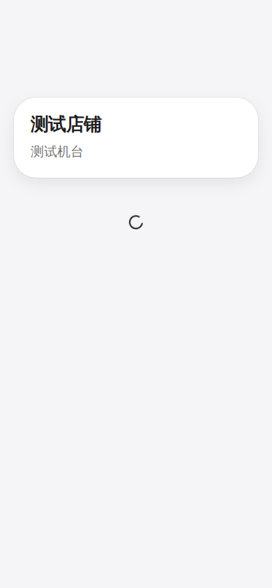
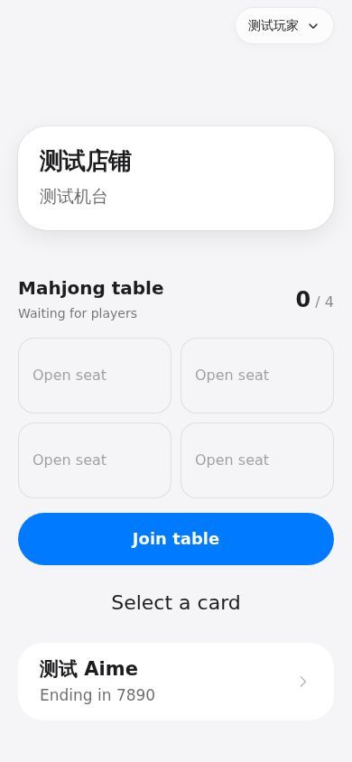

# 扫码性能与请求预算

扫码二维码仍使用 `/t/:shopCode/:publicId`。GET 入口使用 `SESSION_SECRET` 派生的专用密钥、AES-GCM 和随机 IV 生成五分钟的 `v1.` 加密导航 ticket，302 到 `/m#ticket=…`；响应设置 `Cache-Control: no-store` 和 `Referrer-Policy: no-referrer`。密文不包含可读的店铺/机台路径，静态 `/m` 请求不携带 fragment。Web 继续接受旧 query/path ticket，OAuth 返回地址保留 fragment。二维码本身仍是可复制的公开链接，不能作为物理到店证明；需要到店验证的店铺继续使用定位策略。

`/t` 不加载登录身份，不查机台，不插入 `machine_tickets`。生产入口仍受维护 gate 检查，因此只有业务 D1 查询降为零，不能宣称整个入口零 D1。无效/禁用机台在 session API 校验；加密 ticket 每次解析都检查到期、当前机台 enabled、店铺匹配和可选 route ID，再做设备权限、平台绑定、入场和定位验证。原生 session/start 保留响应结构并返回新格式 ticket。旧数据库 ticket 在原到期时间内兼容，使用一次 JOIN 获取完整机台；新 ticket 不创建数据库行。更换 `SESSION_SECRET` 会使尚未到期的新 ticket 立即失效。

## 首屏关键路径

生产 live phase 静态 HTML/JS/CSS 由 Assets 优先处理，动态 route 与部署控制入口继续进入 Worker。Worker 的静态回退也先于 D1 maintenance 查询；maintenance/verify phase 保持所有资源 503，API 与 DO 在所有阶段保留维护 fence。`MachineLoginPage` 进入首包。机台 API 返回后即可显示 ShopHero/机台名，账户区等待 `/me` 后再显示登录或设备操作，不会把用户误显示为已退出。

Web 请求 `/devices/session/state?includePower=0`，先取得绑定/入场/麻将等必要状态。HA 电源另由 `/devices/session/power` 获取，不会阻塞选卡 UI。旧客户端省略 includePower 时保留完整状态响应。电源观察使用最长五秒的 isolate 缓存，合并同一绑定的并发请求、最多保存 500 条；integration/device-states 复用此缓存。真实刷卡的电源检查始终直接查询 HA，开关机成功后失效观察缓存。未知电源状态按失败退避；保留原有未知状态下的服务端设备操作策略。

## 刷新、限流与重试

- 麻将/绑定动态状态正常约三秒刷新；店铺配置与当前账号信息独立加载。店铺 GET 缓存三十秒，player/me 合并并发并缓存一秒。缓存按用户与 route 隔离，成功 mutation、身份刷新、绑定/入场 gate 变化后失效。取消一个组件的订阅不会取消另一个组件的共享请求。
- PagePolling 失败基准间隔为 5/10/20/30/60 秒，带 ±15% jitter，上限六十秒；`Retry-After`（秒数或 HTTP date）是最低等待时间，可超过上限。成功恢复普通间隔。focus/pageshow/visibility 不绕过失败冷却，隐藏和卸载取消订阅。
- KV 的 GET/PUT 计数器已移除。Workers Rate Limiting bindings 使用稳定 actor/action key，各预算为每六十秒 3/5/10/20/30/60 次。扫码、session mint/resolve 在迁移/身份查询前共用每 IP 六十次的导航预算；HTTP 429 返回 `Retry-After: 60`。这是各 Cloudflare location 的 abuse protection，不是全局财务计数；现有 D1 operation lease、投币 cooldown、账务幂等与操作审计继续执行。
- `RATE_LIMIT_KV_ID` 不再是构建变量。`wrangler.platform.jsonc` 的 namespace_id（73003/73005/73010/73020/73030/73060）必须在同一账号内预留；同账号其他 Worker 不应复用这些 ID，除非有意共享预算。缺失限流 binding 返回 503。
- LiveBilling APNs 失败按 token/signature 存储 failureCount/nextAt，最多六次发送尝试，间隔 5/10/20/40/60 秒；耗尽后等待 token 过期或内容/token 变化。成功 token 保留 signature 去重。失败 end 推送也继续调度；不通过 throw 重跑整个 alarm。相同 visit revision 的账单在三十秒内复用，计费边界到达或 revision 变化立即重算。D1/DO 存储等非 APNs 异常仍遵循平台故障语义。

## 清理与可观测性

迁移 `0031_platform_retention.sql` 增加过期索引。每小时第 17 分运行 Cron，每张临时表最多删除 500 条过期行：machine_tickets、auth_challenges、platform_binding_codes、operation_locks；auth_sessions 额外保留过期后一天。维护期间不清理。积压超过每小时 500 条/表时，可重复运行同一有界清理；不在扫码请求里 purge。账务 session、player_operations、device_commands 和财务历史没有自动删除，业务保留期需另外确定。

Worker CPU 上限为 1000ms，避免意外无限执行；应根据生产 CPU 分位数调整，不等同于端到端网络等待预算。现有 observability 保持启用，动态请求记录 1% 样本和全部 5xx 的 route/method/status/durationMs；不记录 ticket、明文二维码参数、IP 或玩家 ID。该样本适合比较延迟，不能直接当作精确 RPS。Cloudflare dashboard 分别查看 Worker request/CPU、D1 rows read/written、DO requests/alarms；尤其比较 `/t`、session/state 的调用量及 HA 超时。D1 暂时仍保留 isolate 内 memoized migration 兼容检查；它不是每请求扫描，生产发布脚本也会先执行迁移/转换。

回归测试覆盖加密/过期/错误密钥、二维码无需 D1、旧 ticket JOIN、跨店与禁用设备、轮询冷却与 Retry-After、共享 GET 缓存、维护 fence、APNs retry 和有界 retention。`.github/workflows/check.yml` 使用 Bun 1.3.14 执行完整测试、类型检查及平台 dry-run，不部署生产环境。CI 为所有 Git 跟踪的 test/spec 文件分别启动 Bun 进程，隔离全局 mocks 和 Miniflare/workerd 生命周期；任何文件失败都会使检查失败。每个用例超时三十秒，容纳真实 Miniflare/D1 启动与事务；生成配置测试使用临时目录，不依赖本地未提交的 `wrangler.generated.jsonc`。本地仍可使用 `bun test`；单进程执行出现环境污染时应按文件重现，而非跳过用例。

浏览器回归由 `scripts/check-scan-browser.cjs` 使用模拟 API 验证 hero 先于 /me、卡片先于 HA、麻将动态轮询期间只获取一次店铺配置；通过 `bun run --cwd packages/prism-web preview` 启动 production build，CI 的 `scan-first-paint` artifact 保存两张移动端截图。截图使用虚构店铺与玩家，不执行真实设备操作；artifact 显式包含 `.scan-check` 目录中的 PNG。

### 首屏回归截图

以下为模拟 API 的移动端截图，分别在身份请求与 HA 请求仍挂起时捕获。

| /me 等待中 | HA 等待中 |
| --- | --- |
|  |  |
