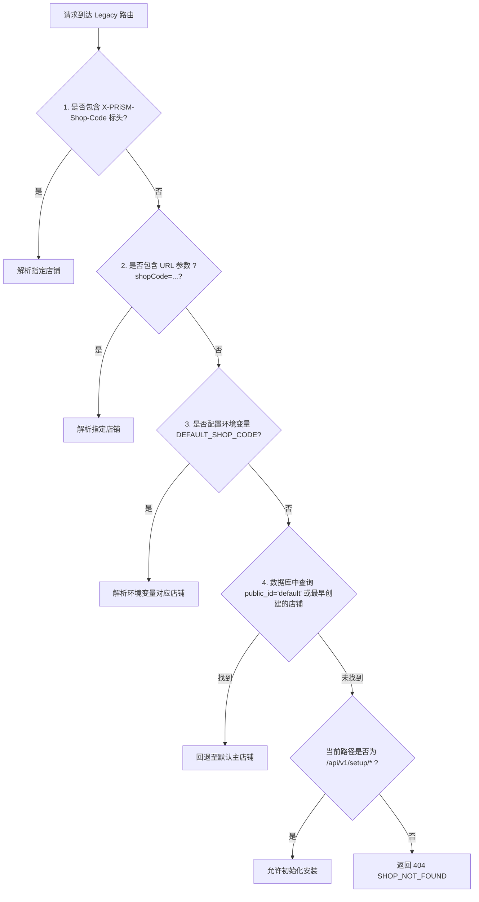

# PRiSM Legacy API Centralization & Isolation (`packages/server/src/legacy`)

## 1. 架构演进与历史背景 (Architecture Background)

在 PRiSM 系统的演进过程中，本项目经历了 **PRiSM Next（单店街机经营系统）** 与 **ArcadeLink（多商户多门店连锁平台）** 的深度融合：

1. **历史单店模式 (PRiSM Next)**：
   早期的 PRiSM Next 假定整个运行实例仅服务于单一物理门店。其 API 设计直接使用全局顶层路径，例如：
   - `/api/v1/player/*`（玩家个人资产、入场会话与出场结算）
   - `/api/v1/staff/*`（店员管理、玩家开卡与流水报表）
   - `/api/v1/integration/*`（QQ / 开黑啦 / 微信等 Koishi Bot 机器人指令）
   - `/api/v1/setup/*`（初始化单店所有者与基本货币资产）

2. **现代多租户架构 (ArcadeLink & @prism/server)**：
   统一后的 `@prism/server` 全面转向多租户资源模型。所有业务流水、资产定义、费率时间线与设备绑定均严格隔离在店铺代码下：
   - 现代路径：`/api/v1/shops/:shopCode/*`
   - 依赖注入：通过原生 Hono 中间件直接加载独占的数据库连接、读写模型与领域服务容器。

3. **集中与隔离治理原则 (Centralization & Isolation)**：
   为了保证现网运行的 Koishi 机器人插件（`koishi-plugin-prism`）、硬件读卡器网关以及商户已有自动化脚本的**平滑过渡与零宕机迁移**，我们在 `packages/server/src/legacy/` 下对所有单店遗留接口进行集中隔离治理：
   - **零污染**：主线路由代码无需感知单店遗留逻辑；
   - **强提示**：所有遗留响应统一附加标准 HTTP 废弃响应头；
   - **智能租户解析**：支持请求头、查询参数以及单店数据库自动回退。

---

## 2. 废弃响应头规范 (Deprecation Headers)

所有通过 `legacyRouter` 访问的遗留单店接口，均会自动附加以下 HTTP 响应头：

| 标头名称 (Header) | 标头值示例 | 规范说明 |
| :--- | :--- | :--- |
| `X-API-Deprecated` | `true` | 标识当前调用的端点为已废弃单店接口。 |
| `X-API-Replacement` | `/api/v1/shops/shanghai-hub/player/assets` | 指向现代多租户架构中对应的替换端点路径。 |
| `Link` | `</api/v1/shops/shanghai-hub/player/assets>; rel="successor-version"` | RFC 8288 Web Linking 规范，声明继任资源 URI。 |
| `Warning` | `299 - "This legacy single-store endpoint is deprecated. Migrate to /api/v1/shops/shanghai-hub/player/assets."` | RFC 7234 HTTP Warning 标头。 |
| `Deprecation` | `true` | RFC 9651 标准废弃标识。 |

---

## 3. 租户智能解析策略 (Tenant Resolution Strategy)

遗留客户端通常无法在 URL 路径中传递 `:shopCode`。`tenant-resolver.ts` 按照如下优先级自动解析目标店铺：



解析成功后，中间件会自动调用 `getOrCreateShopDependencies(db, shop)` 注入店铺领域容器，并同步更新响应本地时区 `responseTimeZone`。

---

## 4. 全量端点映射表 (Full Endpoint Mapping Table)

### 4.1 玩家端接口 (Player Endpoints)

| 遗留单店路径 (Legacy) | 现代多租户路径 (Replacement) | 接口说明 |
| :--- | :--- | :--- |
| `GET /api/v1/player/me` | `GET /api/v1/shops/:shopCode/player/me` | 玩家概要信息与活跃会话 |
| `GET /api/v1/player/assets` | `GET /api/v1/shops/:shopCode/player/assets` | 玩家货币、优惠券与流水 |
| `GET /api/v1/player/checkouts/history` | `GET /api/v1/shops/:shopCode/player/checkouts/history` | 历史结账账单列表 |
| `GET /api/v1/player/checkouts/:id` | `GET /api/v1/shops/:shopCode/player/checkouts/:id` | 单笔账单明细收据 |
| `GET /api/v1/player/checkout/latest` | `GET /api/v1/shops/:shopCode/player/checkout/latest` | 最近一笔结账收据 |
| `GET /api/v1/player/sessions/history` | `GET /api/v1/shops/:shopCode/player/sessions/history` | 入场上机历史记录 |
| `GET /api/v1/player/sessions/:id/history` | `GET /api/v1/shops/:shopCode/player/sessions/:id/history` | 单次会话扣费时间线明细 |
| `POST /api/v1/player/session/start` | `POST /api/v1/shops/:shopCode/player/session/start` | 开启入场会话 |
| `POST /api/v1/player/sessions/:id/stop` | `POST /api/v1/shops/:shopCode/player/sessions/:id/stop` | 结束入场会话（暂不结算） |
| `POST /api/v1/player/checkout/preview` | `POST /api/v1/shops/:shopCode/player/checkout/preview` | 预计算结算账单及抵扣 |
| `POST /api/v1/player/checkout/confirm` | `POST /api/v1/shops/:shopCode/player/checkout/confirm` | 确认扣款完成离场结算 |
| `POST /api/v1/player/redeem` | `POST /api/v1/shops/:shopCode/player/redeem` | 兑换码核销 |
| `POST /api/v1/player/device-commands` | `POST /api/v1/shops/:shopCode/player/device-commands` | 下发机台设备指令 |
| `POST /api/v1/player/business-items/:id/purchase` | `POST /api/v1/shops/:shopCode/player/business-items/:id/purchase` | 购买增值服务项目 |
| `GET /api/v1/player/business-item-orders` | `GET /api/v1/shops/:shopCode/player/business-item-orders` | 增值服务订单列表 |

### 4.2 店员管理接口 (Staff Endpoints)

| 遗留单店路径 (Legacy) | 现代多租户路径 (Replacement) | 接口说明 |
| :--- | :--- | :--- |
| `GET /api/v1/staff/me` | `GET /api/v1/shops/:shopCode/staff/me` | 当前店员角色与权限 |
| `GET /api/v1/staff/players` | `GET /api/v1/shops/:shopCode/staff/players` | 全店玩家档案列表 |
| `POST /api/v1/staff/players` | `POST /api/v1/shops/:shopCode/staff/players` | 录入新玩家 |
| `PATCH /api/v1/staff/players/:id/status` | `PATCH /api/v1/shops/:shopCode/staff/players/:id/status` | 启用/冻结玩家账户 |
| `GET /api/v1/staff/players/:id/assets` | `GET /api/v1/shops/:shopCode/staff/players/:id/assets` | 查询指定玩家资产 |
| `POST /api/v1/staff/players/:id/assets/grants` | `POST /api/v1/shops/:shopCode/staff/players/:id/assets/grants` | 店员人工赠送资产 |
| `POST /api/v1/staff/players/:id/assets/adjustments` | `POST /api/v1/shops/:shopCode/staff/players/:id/assets/adjustments` | 店员人工核减资产 |
| `POST /api/v1/staff/players/:id/wallet/adjustment` | `POST /api/v1/shops/:shopCode/staff/players/:id/wallet/adjustment` | 店员快速调整钱包余额 |
| `POST /api/v1/staff/players/:id/identities` | `POST /api/v1/shops/:shopCode/staff/players/:id/identities` | 绑定第三方身份 |
| `DELETE /api/v1/staff/players/:id/identities/:p/:s` | `DELETE /api/v1/shops/:shopCode/staff/players/:id/identities/:p/:s` | 解绑第三方身份 |
| `GET /api/v1/staff/sessions/active` | `GET /api/v1/shops/:shopCode/staff/sessions/active` | 查看当前店内在席玩家 |
| `POST /api/v1/staff/players/:id/session/start` | `POST /api/v1/shops/:shopCode/staff/players/:id/session/start` | 店员代开启入场 |
| `POST /api/v1/staff/players/:id/sessions/:id/stop` | `POST /api/v1/shops/:shopCode/staff/players/:id/sessions/:id/stop` | 店员强制结束会话 |
| `POST /api/v1/staff/players/:id/checkout/preview` | `POST /api/v1/shops/:shopCode/staff/players/:id/checkout/preview` | 店员预览账单 |
| `POST /api/v1/staff/players/:id/checkout/confirm` | `POST /api/v1/shops/:shopCode/staff/players/:id/checkout/confirm` | 店员代结算 |
| `POST /api/v1/staff/players/:id/checkout/override` | `POST /api/v1/shops/:shopCode/staff/players/:id/checkout/override` | 店员特权改价结算 |
| `GET /api/v1/staff/reports/summary` | `GET /api/v1/shops/:shopCode/staff/reports/summary` | 营收经营概况报表 |
| `GET /api/v1/staff/reports/settlements` | `GET /api/v1/shops/:shopCode/staff/reports/settlements` | 结账流水明细报表 |
| `GET /api/v1/staff/reports/checkouts` | `GET /api/v1/shops/:shopCode/staff/reports/checkouts` | 出场结算单报表 |
| `GET /api/v1/staff/reports/players` | `GET /api/v1/shops/:shopCode/staff/reports/players` | 玩家消费贡献报表 |
| `GET /api/v1/staff/pricing-configs` | `GET /api/v1/shops/:shopCode/pricing` | 计费规则列表 |
| `GET /api/v1/staff/asset-definitions` | `GET /api/v1/shops/:shopCode/assets` | 资产定义列表 |
| `GET /api/v1/staff/redeem-codes` | `GET /api/v1/shops/:shopCode/redeem` | 礼品兑换码管理 |

### 4.3 外部 Bot 与集成接口 (Integration Endpoints)

| 遗留单店路径 (Legacy) | 现代多租户路径 (Replacement) | 接口说明 |
| :--- | :--- | :--- |
| `POST /api/v1/integration/players/by-identity/resolve` | `POST /api/v1/shops/:shopCode/integration/players/by-identity/resolve` | 根据外部身份解析玩家 |
| `POST /api/v1/integration/players/by-identity/register` | `POST /api/v1/shops/:shopCode/integration/players/by-identity/register` | 自动开卡注册玩家 |
| `POST /api/v1/integration/players/by-identity/session/start` | `POST /api/v1/shops/:shopCode/integration/players/by-identity/session/start` | 机器人指令入场 |
| `POST /api/v1/integration/players/by-identity/sessions/:id/stop` | `POST /api/v1/shops/:shopCode/integration/players/by-identity/sessions/:id/stop` | 机器人指令离场 |
| `POST /api/v1/integration/players/by-identity/checkout/preview` | `POST /api/v1/shops/:shopCode/integration/players/by-identity/checkout/preview` | 账单预结计算 |
| `POST /api/v1/integration/players/by-identity/checkout/confirm` | `POST /api/v1/shops/:shopCode/integration/players/by-identity/checkout/confirm` | 确认结账出场 |
| `POST /api/v1/integration/players/by-identity/checkout/override` | `POST /api/v1/shops/:shopCode/integration/players/by-identity/checkout/override` | 特权改价结算 |
| `POST /api/v1/integration/players/by-identity/wallet` | `POST /api/v1/shops/:shopCode/integration/players/by-identity/wallet` | 查询钱包余额 |
| `POST /api/v1/integration/players/by-identity/assets` | `POST /api/v1/shops/:shopCode/integration/players/by-identity/assets` | 查询卡券资产明细 |
| `POST /api/v1/integration/players/by-identity/redeem` | `POST /api/v1/shops/:shopCode/integration/players/by-identity/redeem` | 机器人代兑换礼物 |
| `POST /api/v1/integration/players/by-identity/history` | `POST /api/v1/shops/:shopCode/integration/players/by-identity/history` | 消费历史查询 |
| `POST /api/v1/integration/players/by-identity/device-actions` | `POST /api/v1/shops/:shopCode/integration/players/by-identity/device-actions` | 机器人远程投币/操作 |
| `GET /api/v1/integration/sessions/active` | `GET /api/v1/shops/:shopCode/integration/sessions/active` | 活跃在席玩家状态 |
| `GET /api/v1/integration/device-states` | `GET /api/v1/shops/:shopCode/integration/device-states` | 店内机台实时状态 |

### 4.4 初始化与 RPC 兼容 (Setup & RPC)

| 遗留单店路径 (Legacy) | 现代多租户路径 (Replacement) | 接口说明 |
| :--- | :--- | :--- |
| `GET /api/v1/setup/status` | `GET /api/v1/setup/status` | 查询平台或默认店铺初始化状态 |
| `POST /api/v1/setup/install` | `POST /api/v1/setup/install` | 初始化安装默认店铺与店长凭据 |
| `ALL /rpc/*` | `ALL /api/v1/shops/:shopCode/*` | RPC 别名调用与解包数据包装 |

---

## 5. 废弃排期与退役计划 (Deprecation Schedule)

```
[ 当前阶段 Phase 1 ]  ->  [ 阶段 Phase 2 (过渡期) ]  ->  [ 阶段 Phase 3 (完全日落) ]
   完整兼容运行              服务端监控与告警               停止遗留端点
   自动租户回退              标记为即弃接口 (410 预告)        仅支持 /api/v1/shops/:shopCode/*
   注入废弃响应头            日志告警引导客户端升级
```

- **当前阶段（完全兼容）**：所有遗留路径正常工作，默认店铺回退完全透明，附加 `X-API-Deprecated` 与 `Link` 标头。
- **第二阶段（审计与警告）**：在系统监控与服务日志中记录调用遗留单店接口的客户端 IP 与 User-Agent，定向通知机器人管理员。
- **第三阶段（最终退役）**：在主要生态（如 Koishi 插件版本更新）升级完毕后，遗留接口将正式退役。

---

## 6. 客户端迁移示例 (Migration Examples)

### 6.1 Koishi 机器人插件迁移 (`koishi-plugin-prism`)

**修改前 (Legacy)**：
```typescript
// koishi.config.ts / plugin.ts
const response = await ctx.http.post('http://127.0.0.1:8787/api/v1/integration/players/by-identity/resolve', {
  provider: 'onebot',
  subject: session.userId,
}, {
  headers: {
    Authorization: `Bearer ${config.apiToken}`,
  },
});
```

**修改后 (Modern Multi-tenant)**：
```typescript
// 推荐方式：在插件配置中增加 shopCode 参数（例如 'shanghai-hub'）
const shopCode = config.shopCode || 'default';

const response = await ctx.http.post(`http://127.0.0.1:8787/api/v1/shops/${shopCode}/integration/players/by-identity/resolve`, {
  provider: 'onebot',
  subject: session.userId,
}, {
  headers: {
    Authorization: `Bearer ${config.apiToken}`,
  },
});
```

**临时兼容方式（保留旧 URL，增加标头）**：
```typescript
// 无需重构所有 URL，仅在 HTTP 请求头中附加 X-PRiSM-Shop-Code：
const response = await ctx.http.post('http://127.0.0.1:8787/api/v1/integration/players/by-identity/resolve', {
  provider: 'onebot',
  subject: session.userId,
}, {
  headers: {
    Authorization: `Bearer ${config.apiToken}`,
    'X-PRiSM-Shop-Code': config.shopCode, // 指定目标门店
  },
});
```

### 6.2 自动化脚本与 cURL 迁移

**查询玩家资产 (curl)**：

```bash
# 旧方式 (已废弃):
curl -H "Authorization: Bearer <TOKEN>" \
  https://prism.example.com/api/v1/player/assets

# 推荐现代方式:
curl -H "Authorization: Bearer <TOKEN>" \
  https://prism.example.com/api/v1/shops/shanghai-hub/player/assets

# 兼容过渡方式:
curl -H "Authorization: Bearer <TOKEN>" \
     -H "X-PRiSM-Shop-Code: shanghai-hub" \
  https://prism.example.com/api/v1/player/assets
```
